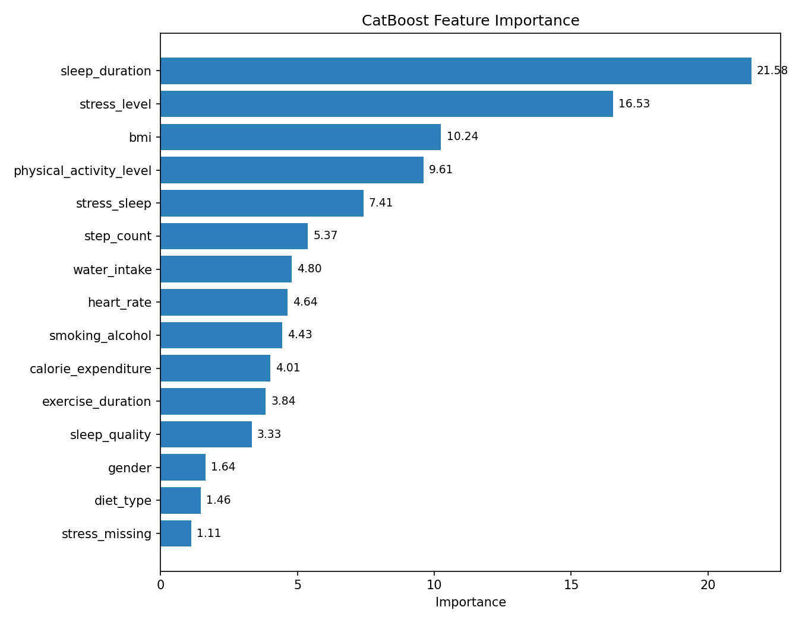

# Student Health Condition Classification

Predicting student health status (`fit`, `at-risk`, `unhealthy`) from lifestyle data (sleep, physical activity, diet, stress, and more) using a CatBoost model, combined with imputation strategies tailored to each feature's missingness pattern and feature engineering guided by experimental validation.

## Project Workflow

```
Raw Data
   |
Data Preprocessing
   |
Missing Value Imputation
   |
Feature Encoding
   |
Feature Engineering
   |
Model Training (CatBoost)
   |
Feature Importance Analysis
   |
Prediction
```

## Project Features

### Preprocessing

- Feature means were checked across the target classes and showed no meaningful difference, so class-conditional imputation was not used.
- Features with less than 5% missing values were imputed with `SimpleImputer`:
  - Numerical features (e.g. `heart_rate`, `bmi`, `exercise_duration`) → mean
  - `step_count` → median
  - Categorical features (`gender`, `smoking_alcohol`, `diet_type`) → most frequent value
- Features with more than 5% missing values (`sleep_duration`, `sleep_quality`, `physical_activity_level`, `calorie_expenditure`, `water_intake`) were imputed with `KNNImputer` on standardized data (`StandardScaler`).
- Features with a natural order (`sleep_quality`, `physical_activity_level`) were ordinally encoded to preserve their ranking.

### Handling `stress_level`

- Unlike other features, missing values in `stress_level` were not filled with the mode, since exploratory analysis showed a meaningful relationship between its missingness and the target variable.
- Instead, a binary flag (`stress_missing`) was created to capture this missingness.
- `stress_level` was then ordinally encoded, and the resulting missing values were intentionally left as `NaN` — CatBoost natively handles missing numerical values and can use the missingness pattern itself as a predictive signal.

### Feature Engineering

More than 30 interaction features were designed and tested during development (e.g. sleep duration categories, combined sleep/stress/activity flags). Only the features that consistently improved validation performance were kept in the final model; the rest remain in the codebase as commented-out functions for reference. The most impactful engineered feature was `stress_exercise` (ratio of stress level to exercise duration), which contributed the largest improvement among all interaction features tested.

### Modeling

- Algorithm: **CatBoostClassifier** with `loss_function="MultiClass"` and `eval_metric="TotalF1"`.
- Class imbalance was handled with `auto_class_weights="Balanced"`, since the `at-risk` class makes up roughly 86% of the data.
- Key hyperparameters: `iterations=800`, `learning_rate=0.05`, `depth=9`, `l2_leaf_reg=5`, `bootstrap_type="Bernoulli"`, `subsample=0.8`.
- Categorical features (`diet_type`, `smoking_alcohol`, `gender`) were passed directly to CatBoost via `cat_features`, without one-hot encoding.
- The final model is persisted with `joblib` so it doesn't need to be retrained for inference.

### Why CatBoost

CatBoost was selected as the final model after comparison with alternative approaches, based on:

- Strong and consistent performance during validation
- Native handling of categorical features, without manual encoding
- Native handling of missing values, allowing missingness itself to be used as a signal (notably for `stress_level`)
- Better generalization on the validation set compared to the other models tested during development

## Dataset

| File                         | Description                                                                           |
| ---------------------------- | ------------------------------------------------------------------------------------- |
| `data/train.csv`             | Raw training data (contains missing values)                                           |
| `data/data_clean.csv`        | Output of the preprocessing stage (`preprocessing.py`) — input to feature engineering |
| `data/test.csv`              | Raw test data (no target column)                                                      |
| `data/sample_submission.csv` | Sample of the required submission format                                              |

Main columns:

| Column                                                                              | Description                                                 |
| ----------------------------------------------------------------------------------- | ----------------------------------------------------------- |
| `sleep_duration`, `sleep_quality`                                                   | Sleep duration and quality                                  |
| `heart_rate`                                                                        | Heart rate                                                  |
| `bmi`                                                                               | Body mass index                                             |
| `calorie_expenditure`, `step_count`, `exercise_duration`, `physical_activity_level` | Calorie burn, step count, exercise duration, activity level |
| `water_intake`                                                                      | Water intake                                                |
| `diet_type`                                                                         | Diet type                                                   |
| `stress_level`                                                                      | Stress level                                                |
| `smoking_alcohol`                                                                   | Smoking/alcohol use                                         |
| `gender`                                                                            | Gender                                                      |
| `health_condition`                                                                  | Target variable — `fit`, `at-risk`, `unhealthy`             |

## Installation

```bash
pip install pandas numpy scikit-learn catboost joblib
```

## How to Run

### Train the model from scratch

```bash
# 1. Preprocess the raw data (output: data/data_clean.csv)
python src/preprocessing.py

# 2. Train the model and view the performance report
python main.py
```

### Predict with the saved model

```bash
python src/predict.py
```

This script loads the saved model (`cat_model2.pkl`), applies preprocessing and feature engineering to `data/test.csv`, and generates `submission.csv` in `id, health_condition` format.

## Model Results

Results from the final model version (logged as `cat4` in the code):

| Class     | Precision | Recall | F1-score |
| --------- | --------- | ------ | -------- |
| at-risk   | 0.99      | 0.94   | 0.96     |
| fit       | 0.74      | 0.95   | 0.83     |
| unhealthy | 0.70      | 0.96   | 0.81     |

- **Overall Accuracy**: 94%
- **Balanced Accuracy**: 94.92%
- **Macro Avg F1**: 0.87

### Feature Importance



| Feature                   | Importance |
| ------------------------- | ---------- |
| `sleep_duration`          | 21.58      |
| `stress_level`            | 16.53      |
| `bmi`                     | 10.24      |
| `physical_activity_level` | 9.61       |
| `stress_sleep`            | 7.41       |
| `step_count`              | 5.37       |

Sleep duration, stress level, and BMI are the strongest predictors of health status.

## Kaggle Public Leaderboard

Final public leaderboard score: **Balanced Accuracy = 0.94917**

This score was achieved using a single CatBoost model with carefully engineered features, rather than leaderboard-specific tricks or ensembling.

## Challenges

- Handling missing values across features with very different missingness rates and patterns
- Significant class imbalance, with `at-risk` dominating the target distribution
- Feature selection: distinguishing engineered features that generalize from those that only fit the validation set
- Distribution differences between features that required different imputation strategies
- Avoiding over-engineering — keeping only interaction features with a consistent, measurable benefit

## Tech Stack

- Python
- Pandas / NumPy
- Scikit-learn (SimpleImputer, KNNImputer, StandardScaler, train_test_split)
- CatBoost
- Joblib

## Project Structure

```
.
├── main.py                      # Main script: data loading, final feature engineering, model training and evaluation
├── src/
│   ├── preprocessing.py         # Raw data cleaning and imputation
│   ├── feature_engineering.py   # Interaction feature construction
│   └── predict.py               # Loads the saved model and generates submission.csv
├── data/
│   ├── train.csv                # Raw training data
│   ├── data_clean.csv           # Preprocessed data
│   ├── test.csv                 # Raw test data
│   └── sample_submission.csv    # Sample submission format
├── cat_model2.pkl               # Trained and saved CatBoost model
├── submission.csv               # Final prediction output
└── README.md
```

## Additional Notes

- Many feature engineering ideas (e.g. `sleepDU_cate`, `sleepL_stress_flag`, various sleep/stress/activity combinations) were tested during development but did not yield a meaningful improvement in validation score, so they remain commented out in the codebase. The active code only includes features that had a measurable positive effect on model performance.
- The choice between `SimpleImputer` and `KNNImputer` was driven by each column's missingness rate: columns with low missingness (under 5%) used simpler, faster methods, while columns with higher missingness used the more accurate `KNNImputer`.
- Keeping `NaN` values in `stress_level` (instead of imputing them) was a deliberate choice, allowing CatBoost to use the missingness pattern itself as a predictive signal.
- Result comments for different model iterations (`cat3`, `cat4`, etc.) are kept at the end of `main.py` to document the model's progression during development.

## Future Work

- Hyperparameter optimization with Optuna
- Model explainability with SHAP
- Automated search for feature interactions
- Comparison against foundation models such as TabPFN

## License

This project was created for educational/personal purposes.
